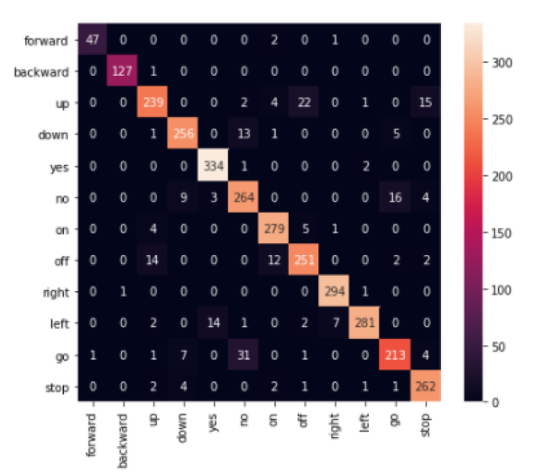

# Key word spotting from audio
In this repository implement and experiment with several neural network architectures for key word spotting.

## Dataset information

The Google Speech Commands dataset version 2 is used to perform key word spotting from audio. The dataset contains 105,829 audio recordings of people uttering a single word in WAV format There are a total of 35 key words uttered that can be put into 3 categories: Numbers (zero to nine), Commands : "forward", "backward", "up", "down", "yes", "no","on", "off", "right", "left", "go" and "stop" and Auxiliary words: "bed", "bird", "cat", "dog","happy", "house", "marvin",
"sheila", "tree", "follow", "learn", "visual" and "wow". The dataset also contains background noise files which are excluded for the scope of this study.

## Pre-processing

There are several architectures like the Recurrent neural network (RNN) and Long short term memory networks (LSTMs) that were developed to account for temporal information in the data such as audio. However, in this repository we focus on convolutional nueral networks as a means to model audio data.

To achieve this, the audio is first converted into an image using the Mel-Frequency Cepstral Coefficients (MFCC) transform. The procedure to achive the MFCC is shown below:

As can be seen in the figure, we first define a window and divide the signal into different time frames by sliding over this window. We then compute the Fast Fourier Transform(FFT) for each time
frame to obtain features in the frequency domain. Further, we apply logarithmic Mel filter bank to the transformed frames. However, the filter bank coefficient calculated are highly correlated. Hence, we compute the Discrete Cosine Transformation(DCT) to decorrelate
the filter bank coefficients which gives us the MFCC feature. 

The conversion of an audio signal to a MFCC is shown below.

## Training and inference

The folder structure of this repository is as follows:

The 'data' folder contains the original dataset with sub-folders for each keyword audio class. Each subfolders contains several .wav audio files belonging to that class.

The 'key_word_spotting.ipynb' notebook can be used to convert the audio files into MFCCs and train and compare 3 neural network types (single layer perceptron, dense network and convolutional neural network).

The performance and comparison of the algorithms is shown below:

The results in terms of a confusion matrix is shown below:

## References

@article{Warden2018SpeechCA,
  title={Speech Commands: A Dataset for Limited-Vocabulary Speech Recognition},
  author={Pete Warden},
  journal={ArXiv},
  year={2018},
  volume={abs/1804.03209}
}

  

